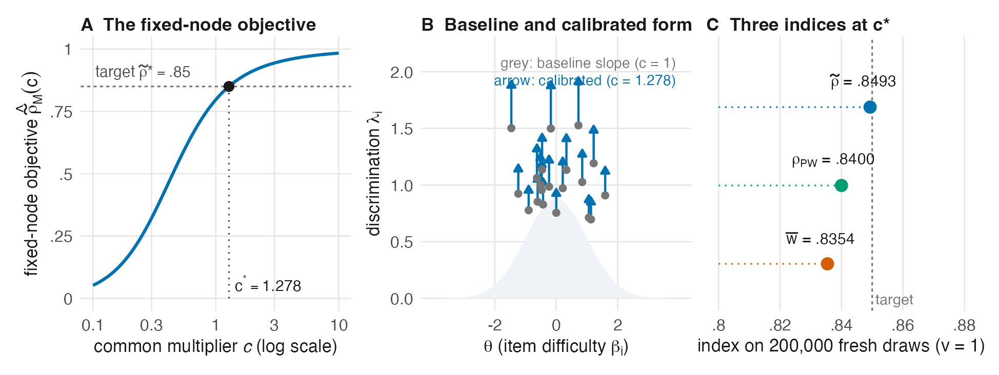

<!-- Author: JoonHo Lee (jlee296@ua.edu) -->

# Calibrate one form

We target .85 for a 20-item 2PL form under a standard normal latent population. The calibration changes all baseline discriminations by one common multiplier. The difficulties stay fixed for this calculation.

```sh
Rscript run_all.R example
```

Open `output/example/calibration.csv`. You should see a multiplier near 1.277857, a solver-node index near .850000, and an independent evaluation near .849322. The returned item parameters are in `output/example/item_form.csv`.

The solver uses 20,000 nodes. We then evaluate the calibrated form on 200,000 fresh normal draws, standardized to variance one. The solver used the variance represented by its own nodes, which is also reported. These two numerical evaluations are close, but they answer different checks: solving an equation accurately does not remove integration error.



The requested index summarizes test information over the specified latent distribution. It does not determine the entire information curve, and it is not an empirical EAP or WLE reliability estimate. Later validation separates these quantities.

Read `code/01_simulation/worked_example.R` next. Its steps follow the order above: define a target, call the calibrator, draw an independent evaluation sample, and write the returned values.
