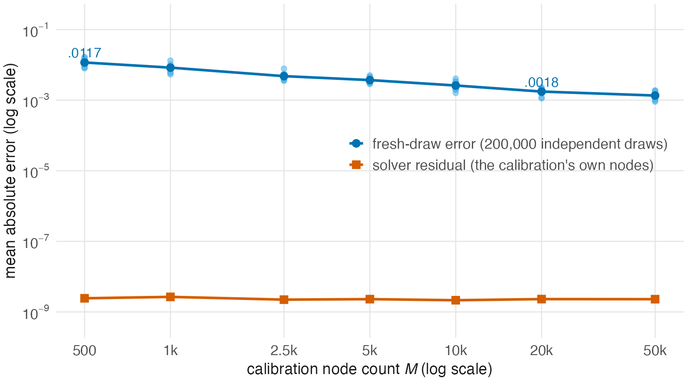

<!-- Author: JoonHo Lee (jlee296@ua.edu) -->

# Rerun the validation studies

We separate solver accuracy, integration error, and variation caused by drawing new people. A small solver residual alone cannot establish all three.

## Reconstruct the accepted requests

```sh
Rscript run_all.R feasibility --pool both --workers 2
```

The full screen has 128 structural cells: four item models, four latent shapes, two difficulty sources, and four test lengths. Six targets create 768 possible requests. The screen retains 748. It uses the calibration search interval [.1, 10].

The four latent shapes are normal, bimodal, positively skewed, and standardized t5. The four item models are Rasch, 2PL, 3PL with guessing .20, and 3PL with Beta(5,17) guessing. The parametric laws and numerical controls are in `config/validation_design.yml`; the software defines the latent generators.

Smoke mode screens the 20-item 2PL conditions. Full mode reconstructs all 748 accepted requests and their design seeds. Because the later calibration draws its own seeded form, five accepted requests are still infeasible for that particular form. We retain those outcomes.

## Check the solver on its own nodes

```sh
Rscript run_all.R calibration --pool both --workers 2
Rscript run_all.R summarize --study calibration
```

Smoke mode selects 32 requests: all model/shape/pool combinations at 10 items and target .70. Without `--pool both`, it selects the 16 parametric requests. Both modes use 20,000 solver nodes, tolerance 1e-6, and the original search interval and root policy.

Read `results.csv`, then `comparison.csv` under `output/runs/calibration/smoke/`. A small `eqc_delta` means the solver met its target on its own numerical rule. `kernel_vs_package` checks that the independent local information calculation agrees with the package on those same nodes.

In the retained full run, 743 of 748 requests succeeded. Their mean absolute solver residual was about 1.54e-9. These are numerical calibration results, not evidence that a response model gives valid standard errors.

## Evaluate fresh draws and vary node count

```sh
Rscript run_all.R nodes --workers 2
Rscript run_all.R summarize --study nodes
```

The full design combines three item models, two latent shapes, two test lengths, seven node counts, and 20 seeds: 1,680 runs. Every returned form is evaluated on 200,000 fresh latent draws. Smoke mode keeps the normal and skewed 10-item 2PL conditions at 500 and 20,000 solver nodes, with one seed.

Compare `calibration_residual` with `holdout_error`. The first can be tiny even when the second is appreciable. In the full retained study, fresh-draw MAE falls from about .0117 at 500 nodes to below .005 at 2,500 nodes. More nodes improve the numerical representation of the latent distribution; they do not change the scientific target.



## Compare algorithms and initialization

```sh
Rscript run_all.R algorithms --workers 2
Rscript run_all.R steps --workers 2
Rscript run_all.R superpopulation
```

The fixed-form algorithm comparison includes EQC, warm and cold stochastic starts, and inverse-information calibration where the population expectation exists. The step study changes one stochastic-approximation setting at a time around a central configuration. These are not separate draws from one common performance distribution; their settings define the comparison.

The item-population command uses IRTsimrel 0.3.1 and 380 eligible requests in full mode. It targets the transform of expected information across random forms. The average of the separately transformed form indices is also reported, but is descriptive. Their difference is expected from Jensen's inequality.

For the heavy-tailed t5 case, the population reciprocal-information expectation diverges. The code keeps the finite-node truncation separate instead of presenting it as the population inverse-information index.

## Draw new people and recover parameters

```sh
Rscript run_all.R sampling
Rscript run_all.R recovery --workers 2
```

The repeated-person study reconstructs each calibrated bank and varies person sample size over 100, 250, 500, 1,000, and 2,000. Full mode uses 1,000 repetitions per sample size; smoke mode uses ten for one parametric condition. These repetitions evaluate information indices on new latent draws; they do not generate and fit binary responses.

The recovery study does generate responses and fits Rasch or 2PL models with TAM. Full mode uses 48 conditions and 200 response replications per condition; smoke mode uses two conditions and two replications. Its analytic indices and fitted score reliabilities are compared without treating them as identical estimands.

## Run the complete designs

Add `--mode full` to each command and use `--pool both` for studies with IRW cells. The README gives the complete sequence. Each study starts independently from the frozen design and writes to its own output directory.

After interruption, rerun the same command. Matching checkpoints are reused. If the code, context, package version, or R version changed, move the old output directory before starting again. The error protects you from combining incompatible runs.
