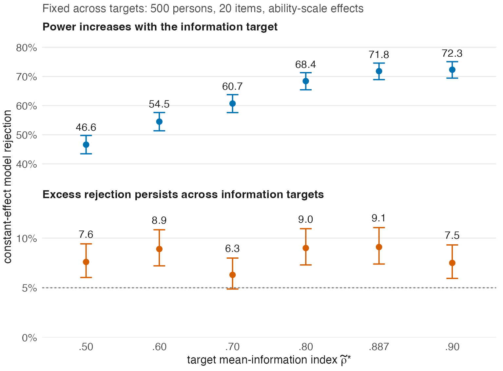

<!-- Author: JoonHo Lee (jlee296@ua.edu) -->

# Explore the supplementary applications

## Item-generation recipes

```sh
Rscript run_all.R recipes --workers 2
```

The full atlas evaluates 25 recipes under four latent shapes and two difficulty pools, with 500 item-form draws per cell. Smoke mode uses the first recipe, all four shapes, and two form draws. It illustrates how a recipe induces a distribution of information levels rather than one declared target.

## Item-level treatment effects

```sh
Rscript run_all.R treatment --workers 2
Rscript run_all.R summarize --study treatment
```

Arm A keeps 500 persons and 20 items while varying the information target. We fit constant and varying item-effect models to each generated dataset. Under the primary `theta_fixed` convention, the treatment-effect distribution is held fixed in latent coordinates as measurement changes. The `logit_fixed` sensitivity holds the logit coefficients fixed instead.

Full mode has 36 primary conditions with 1,000 datasets each and 36 sensitivity conditions with 100 datasets each. Each dataset gives two model rows. Smoke mode selects four datasets at two targets, retaining 500 persons and 20 items.



The figure makes two points. Power for a nonzero average effect can change with the information level. Excess rejection from ignoring item-effect variation can persist across that same range. Targeting lets us compare those outcomes at stated information levels; it does not guarantee that an inferential model is adequate.

`Rscript run_all.R treatment-b` runs the original Arm-B fits for the supplementary design. It does not reproduce the later optimizer-retry and boundary-analysis decisions. Use the retained resolved outputs when checking those published displays.

## Differential item functioning and scores

```sh
Rscript run_all.R dif
Rscript run_all.R scores --workers 2
```

The DIF command runs the MH form-cluster study. It keeps the same item form and named random streams across paired arms and variants. Its full design has 32 structural cells and 100 independent forms per cell. Smoke mode uses two forms in one parametric structural cell.

Keep forms as the independent clusters when interpreting rejection rates. Multiple items from one form are not independent simulation replications. The code retains form-level numerators and denominators so a reader can inspect that distinction.

The score comparison fits TAM models and compares sum, EAP, and WLE scores under equal and unequal group spreads. It is a separate illustration, not a direct validation of the mean-information index as a fitted-score reliability.

See `docs/reproduction-scope.md` for the historical point estimates, external fidelity comparison, and publication-stage analyses distributed as retained evidence.
